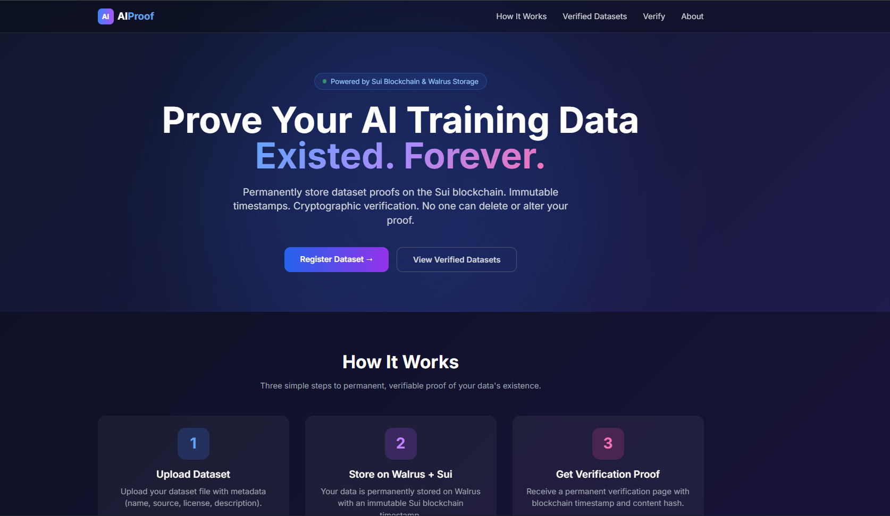
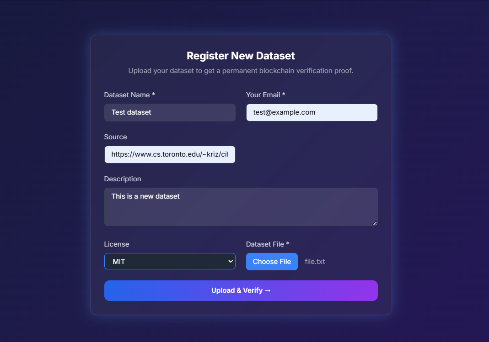
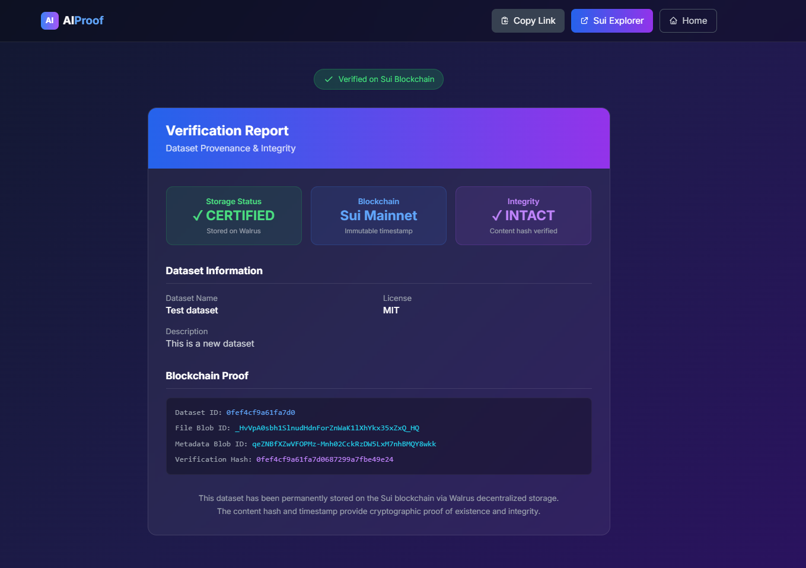
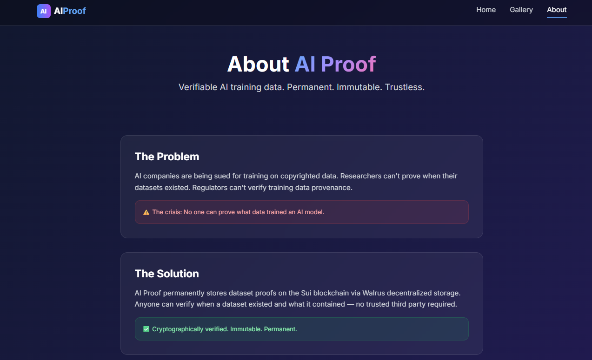

# 🔷 AI Proof — Verifiable AI Training Data on Sui

**Permanent. Immutable. Trustless.**

[](https://flask.palletsprojects.com/)
[](https://walrus.space/)
[](https://sui.io/)
[]()

---

## 🎯 The Problem

AI companies are being sued for training on copyrighted data. Researchers can't prove when their datasets existed. Regulators can't verify training data provenance.

**The crisis: No one can prove what data trained an AI model.**

---

## ✅ The Solution

AI Proof permanently stores dataset proofs on the Sui blockchain via Walrus decentralized storage. Anyone can verify when a dataset existed and what it contained — no trusted third party required.

---

## 🚀 Features

| Feature | Description |
|---------|-------------|
| 📤 Upload Dataset | Upload any file (CSV, JSON, images, text) with metadata |
| 🔒 Permanent Storage | Data stored forever on Walrus decentralized storage |
| ⏱️ Immutable Timestamp | Sui blockchain records exact time of upload |
| 🔗 Shareable Proof | Permanent verification link for each dataset |
| ✅ Cryptographic Verification | Content hash proves data hasn't been altered |
| 🖼️ Gallery | View all verified datasets |
| 📋 Copy Link | One-click copy verification link |

---

## 🛠️ Tech Stack

| Layer | Technology |
|-------|------------|
| **Backend** | Flask (Python) |
| **Decentralized Storage** | Walrus (on Sui) |
| **Blockchain** | Sui Mainnet |
| **API** | Tatum (Sui RPC + Storage) |
| **Database** | SQLite |
| **Frontend** | HTML + Tailwind CSS |

---

## 📸 Screenshots

### Homepage


### Upload Form


### Verification Page


### About Page


---

## 📦 Installation

### Prerequisites

- Python 3.12+
- Tatum API key (free from [dashboard.tatum.io](https://dashboard.tatum.io))

### Setup

```bash
# Clone the repository
git clone https://github.com/yourusername/ai-proof.git
cd ai-proof

# Create virtual environment
python -m venv venv
source venv/bin/activate  # On Windows: .\venv\Scripts\activate

# Install dependencies
pip install -r requirements.txt

# Create .env file
echo "TATUM_API_KEY=your_api_key_here" > .env

# Initialize database
python -c "from database import init_db; init_db()"

# Run the app
python app.py